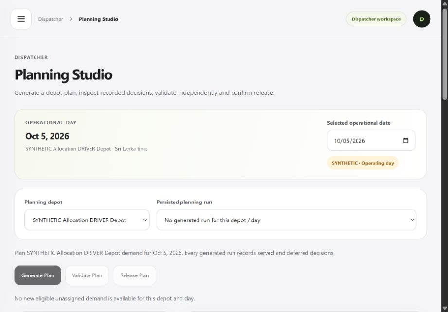

# Waypoint Pulse

**Team Code Crunchers · Tech-Triathlon 2026 Hackathon**

[](https://github.com/sameer-jr/CodeCrunchers_WaypointPulse/actions/workflows/docker-compose-verification.yml)

Waypoint Pulse is a responsive delivery-operations platform for the fictional **Waypoint Group**. It connects the complete delivery workflow across four roles through one shared operational state:

**Store Manager → Dispatcher → Loader → Driver → Store Manager**

> **One order. One system. Four perspectives.**

---

## Submission links

| Resource | Link |
| --- | --- |
| **Live application** | [Open Waypoint Pulse](https://web-production-87afe.up.railway.app) |
| **Source repository** | [CodeCrunchers_WaypointPulse](https://github.com/sameer-jr/CodeCrunchers_WaypointPulse) |
| **Docker verification** | [GitHub Actions workflow and runs](https://github.com/sameer-jr/CodeCrunchers_WaypointPulse/actions/workflows/docker-compose-verification.yml) |
| **Demo video** | **Not recorded yet.** A public recording link remains outstanding. |

---

## Starter accounts

The Railway deployment uses these four seeded role accounts. **Seeded accounts** are starting login accounts created during installation, with their assigned roles and access. They let reviewers sign in immediately; they do not mean that orders or completed deliveries are preloaded.

**Password for all four accounts:** `WaypointJudge!2026`

| Role | Email | Main screen |
| --- | --- | --- |
| Dispatcher | `dispatcher@waypoint.local` | `/dispatcher/pulse` |
| Loader | `loader@waypoint.local` | `/loader/loads` |
| Driver | `driver@waypoint.local` | `/driver/today` |
| Store Manager | `store@waypoint.local` | `/store/home` |

**Operational dates:** the application uses the current **Asia/Colombo** clock and normal calendar/cutoff rules.

> Starter reference records are independently authored and publication-safe. The confidential competition dataset is not redistributed through the public repository.

---

## Normal workflow quickstart

The verified **October 5, 2026 starting snapshot** contains safe starter accounts and reference records only, with zero orders, plans, trips, loading, deliveries, proof or receipts. Private backup/restore, the 37-request HTTPS smoke and **all four role browser checks passed**, without creating business records. Users create all orders through the ordinary Store workflow; subsequent user activity persists. See the dated snapshot and release evidence in [production starter readiness](docs/production-starter-readiness.md).

Open [Waypoint Pulse](https://web-production-87afe.up.railway.app), sign in with the appropriate role and use the ordinary navigation. There is no competition-demo panel or fixed demonstration date. Choose the operational/eligible date shown by the application.

| Step | Role | Start here |
| --- | --- | --- |
| 1 | Store Manager | Place Order → assigned outlet → enter demand and submit; inspect its confirmed state and eligible service date |
| 2 | Dispatcher | Planning Studio → that eligible date → Generate → Explain → Validate → Release; assign Driver |
| 3 | Loader | Today's Loads → that released trip → record quantities; resolve any shortfall with Dispatcher → Ready for Dispatch |
| 4 | Driver | Today → assigned ready trip → Start Trip → arrival → proof → sync → Finish Trip |
| 5 | Store Manager | Track the same delivered order → explicitly confirm the actual received quantity |

Initially all workspaces have no operational work. Store must create demand, Dispatcher must release a plan, and Loader must record readiness before Driver can start. Photos/signatures and GPS remain available when users reach delivery or an active trip. No order or completed example is preloaded.

User actions persist across reload/deployment. Normal startup never resets them. A maintenance reset is a separate guarded operator action requiring a private backup and verified restore. The competition dataset remains private.

### Current screenshots

These actual production captures show the fresh starter workspaces on **October 5, 2026**, plus the full sign-in page on **October 6**. Their dates and empty counts describe their capture, rather than a permanent live inventory. Browse all six role/setup captures and the separately labeled historical workflow evidence in the [screenshot index](docs/screenshots/README.md).



---

## What Waypoint Pulse solves

Waypoint Group operates a shared distribution network serving:

- **Waypoint Fresh** — groceries, chilled and frozen goods
- **Waypoint Style** — garments and cartons
- **Waypoint Tech** — appliances and consumer electronics

The delivery operation must coordinate shared fleet capacity while respecting:

- weight and volume limits
- ambient vs refrigerated transport
- van-only outlet access
- delivery and mall receiving windows
- Fresh morning deadlines
- weekly fuel limits
- a maximum of two trips per vehicle per day
- loading shortages and delivery exceptions
- unreliable field connectivity

Waypoint Pulse replaces fragmented spreadsheet, phone-call and paper coordination with a connected, auditable workflow.

---

## End-to-end workflow

```text
Store Manager
     │
     │ creates order
     ▼
Dispatcher
     │
     │ Generate → Explain → Validate → Release
     ▼
Loader
     │
     │ load checklist → report shortfall
     ▼
Dispatcher
     │
     │ approve/reject revised manifest
     ▼
Loader
     │
     │ Ready for Dispatch
     ▼
Driver
     │
     │ route → delivery → offline queue → sync
     ▼
Store Manager
     │
     │ confirm receipt / report issue
     ▼
Dispatcher
     └── final operational visibility
```

All roles work on the same persisted orders, trips, quantities, exceptions and audit history.

---

<a id="final-judge-walkthrough"></a>

## Workflow and recording

Users create demand through Store before any planning or execution work appears. Follow the role sequence in [Normal workflow quickstart](#normal-workflow-quickstart). The [six-minute recording script](docs/demo-script.md) follows a newly created order through actual planning, loading, delivery and receipt, using its real eligible date and IDs.

Earlier fixed-date fixture journeys and completed proof remain documented in the historical milestone/release reports. They do not describe the requested normal production starting inventory. Record on a separate safe installation if the public system must remain untouched for reviewers.

---

## Key capabilities

### Dispatcher

- Today’s Delivery Pulse
- scoped order queue
- deterministic Planning Studio
- real allocation to vehicles and trips
- independent plan validation
- served and deferred decisions
- **Explain My Plan**
- capacity, temperature, outlet-access, delivery-window and fuel checks
- Routes / Trips
- Exception Centre
- Driver assignment
- scoped outlet coordinates, trip maps and reported Driver position
- authorized delivery photo/signature gallery

### Loader

- phone-responsive released-load workflow
- actual planner stop sequence
- quantity checklist
- persisted loaded quantities
- shortfall reporting
- Dispatcher approval/rejection
- guarded Ready for Dispatch

### Driver

- phone-first Today / Route / Proof / Offline-Sync experience
- assigned ready trips only
- persisted start, arrival and delivery outcomes
- delivered quantity cannot exceed loaded quantity
- recipient/outcome proof with optional photos and a touch signature
- PWA application shell
- per-user IndexedDB route cache
- durable UUID offline operation queue
- offline reload
- ordered reconnect synchronization
- idempotent replay
- retained visible conflicts
- offline media payloads and pending previews
- optional foreground location sharing for an active trip

### Store Manager

- assigned-outlet Home
- Place Order
- server-side 16:00 Asia/Colombo cutoff handling
- persisted tracking
- deferral visibility
- ordered / loaded / delivered / received quantities kept separate
- explicit receipt confirmation
- quantity, damage and other receipt issues
- authorized delivery photos/signature and a map restricted to its own stop

---

## Explain My Plan

The photo/signature/maps follow-up is described under [Current feature verification](#current-feature-verification). Its Linux CI and production acceptance are separate from the earlier verified release.

Waypoint Pulse does not treat planning as a black box.

The allocation engine stores real evidence for constraint checks such as:

- depot match
- vehicle availability
- temperature compatibility
- van-only access
- weight capacity
- volume capacity
- maximum trips per day
- receiving windows
- mall windows
- Fresh morning deadline
- fuel quota
- complete trip-time feasibility

Served decisions retain the checks behind their assignment and limited rejected alternatives. Deferred decisions retain machine-readable blocking reasons.

The planner is deterministic and explainable. It does **not** call an LLM, ML model or the supplied precomputed allocation as its planning result.

---

## Planning strategy

Demand priority considers:

1. previous deferrals
2. scarcity of structurally compatible vehicles
3. receiving-window tightness
4. initial eligible date
5. order creation time
6. stable order reference

Feasible candidates then prefer:

1. preserving scarce reefer/van capability when unnecessary
2. filling an existing draft trip before creating another
3. lower incremental estimated fuel
4. better remaining weight and volume fit
5. earlier completion
6. stable vehicle/trip tie-breakers

A separate validator independently re-checks the persisted generated result before release.

---

## Technology stack

### Frontend

- React
- TypeScript
- Vite
- React Router
- TanStack Query
- React Hook Form
- Zod
- Tailwind CSS
- Service Worker
- IndexedDB
- Leaflet maps with on-demand OpenStreetMap tiles

### Backend

- Node.js
- TypeScript
- Express
- Zod

- Sharp image validation and re-encoding

### Persistence

- PostgreSQL
- Prisma ORM
- 30 normalized models
- 10 versioned SQL migrations
- transactional domain services
- database integrity guards

### Infrastructure

- Docker
- Docker Compose
- Nginx
- GitHub Actions
- Railway
- Railway-managed PostgreSQL

### Testing

- Vitest
- Supertest
- real PostgreSQL integration tests
- browser acceptance checks
- deployed offline/reconnect verification

---

## Architecture

```text
┌─────────────────────────────────────────────┐
│              React / Vite Web               │
│                                             │
│ Store · Dispatcher · Loader · Driver        │
│ Driver PWA + IndexedDB offline queue        │
└────────────────────┬────────────────────────┘
                     │ /api
                     ▼
┌─────────────────────────────────────────────┐
│                Express API                  │
│                                             │
│ Auth / RBAC / Scope                         │
│ Order Lifecycle                             │
│ Planning Engine                             │
│ Independent Validator                       │
│ Loading / Delivery / Receipt                │
│ Exceptions / Audit                          │
│ Idempotent Offline Sync                     │
└────────────────────┬────────────────────────┘
                     │ Prisma
                     ▼
┌─────────────────────────────────────────────┐
│                PostgreSQL                   │
│                                             │
│ Users · Orders · Vehicles · Trips · Stops   │
│ Allocations · Loads · Deliveries · Receipts │
│ Exceptions · Deferrals · OfflineOperations  │
│ Audit Events                                │
└─────────────────────────────────────────────┘
```

Detailed documentation:

- [Architecture](docs/architecture.md)
- [Data model](docs/data-model.md)
- [AI disclosure](docs/AI_DISCLOSURE.md)
- [Final Hackathon verification — historical release](docs/final-hackathon-verification.md)
- [Photo/signature/maps verification — prior accepted feature release](docs/media-maps-verification.md)
- [Production starter readiness — current setup and reset status](docs/production-starter-readiness.md)
- [Previous prepared review scenario — historical evidence](docs/competition-review-readiness.md)
- [Documentation index — current guides and historical reports](docs/README.md)
- [Screenshot index — current starter and historical workflow captures](docs/screenshots/README.md)

---

## Repository structure

```text
CodeCrunchers_WaypointPulse/
├── apps/
│   ├── web/                 # React application and Driver PWA
│   └── api/                 # Express API and domain services
├── packages/
│   └── shared/              # Shared schemas and DTOs
├── prisma/                  # Schema, migrations and seed
├── scripts/                 # Setup, verification and judge helpers
├── docs/                    # Architecture, data model, disclosure and reports
├── .github/
│   └── workflows/
│       └── docker-compose-verification.yml
├── docker-compose.yml
├── .env.example
├── package.json
└── README.md
```

Private competition resources are intentionally excluded from Git and Docker build contexts.

---

## Installation with Docker

The repository can be run as a complete Docker stack.

### Requirements

- Git
- Docker Engine or Docker Desktop
- Docker Compose

### 1. Clone

```bash
git clone https://github.com/sameer-jr/CodeCrunchers_WaypointPulse.git
cd CodeCrunchers_WaypointPulse
```

### 2. Create environment configuration

Linux/macOS:

```bash
cp .env.example .env
```

Windows PowerShell:

```powershell
Copy-Item .env.example .env
```

Before startup, configure:

```env
POSTGRES_USER=waypoint
POSTGRES_PASSWORD=<fresh-local-database-password>
POSTGRES_DB=waypoint

AUTH_SECRET=<fresh-random-secret-at-least-32-characters>

SEED_DEMO_PASSWORD=WaypointDemo!2026

WEB_PORT=5173
WEB_ORIGIN=http://localhost:5173
NODE_ENV=development

PUBLIC_JUDGE_DEMO=false
STARTER_REFERENCE_DATA=true
```

`STARTER_REFERENCE_DATA=true` prepares only publication-safe operational references and role scope, with dates based on the current Asia/Colombo clock. Keep `PUBLIC_JUDGE_DEMO=false` for normal operation. Startup seeds no orders, plan, trip, loading, delivery, proof or receipt. Users create demand and perform every step through the normal application. Repeat startup preserves their work; it is not a reset. Live cleanup/verification is recorded in [production starter readiness](docs/production-starter-readiness.md). Historical local judge helpers remain separate development fixtures.

Replace both secret placeholders before starting. The checked-in `.env.example` defaults to `STARTER_REFERENCE_DATA=false`, which creates the four authentication accounts only. Enable it as shown above for usable publication-safe references and role scope. Keep private credentials in the ignored `.env` file.

### 3. Start the complete stack

```bash
docker compose up --build
```

This starts:

- PostgreSQL
- API
- Web application
- committed database migrations
- seeded role accounts
- publication-safe starter reference records; no operational orders/history

Open:

```text
http://localhost:5173
```

Health:

```text
http://localhost:5173/api/health
```

### 4. Local starter credentials

With the example `SEED_DEMO_PASSWORD` above, the local account password is:

```text
WaypointDemo!2026
```

Accounts:

```text
dispatcher@waypoint.local
loader@waypoint.local
driver@waypoint.local
store@waypoint.local
```

### 5. Stop

```bash
docker compose down
```

To also remove the local database volume:

```bash
docker compose down -v
```

This permanently deletes that local Compose database volume. Ordinary `docker compose down` preserves it.

## Local development without Docker

Install **Node.js 22.13 or later** and Git. After cloning, install dependencies and create the ignored local configuration:

```bash
npm ci
npm run setup:local
```

`setup:local` generates database/session secrets for a new `.env` and preserves an existing file. For safe starter workflows, edit that file to set `STARTER_REFERENCE_DATA=true`, keep `PUBLIC_JUDGE_DEMO=false`, and remove any `DISPATCHER_DEMO_DATE`. Keep the example localhost database URL/port for the embedded PostgreSQL helper.

In the first terminal:

```bash
npm run dev:db
```

Wait for **Local PostgreSQL ready**. This applies migrations and seeds authentication accounts. In a second terminal, install the optional starter references and start API/Web:

```bash
npm run seed:public-judge
npm run dev
```

Despite its legacy command name, `seed:public-judge` installs only starter references when `STARTER_REFERENCE_DATA=true`; it creates no orders or transactions. Open [localhost:5173](http://localhost:5173) and check [API health](http://localhost:5173/api/health). If port 5173 is occupied, stop the conflicting process before starting so the browser origin matches `WEB_ORIGIN`.

Use the four account emails above with your local `SEED_DEMO_PASSWORD`. On Windows, use `npm.cmd` if PowerShell blocks `npm.ps1`. Stop API/Web and then PostgreSQL with **Ctrl+C** in their terminals; the ignored `.local/postgres` database is preserved.

---

## Shared competition dataset

The organizer-provided shared dataset is **not redistributed through this public repository**.

The application includes a validated importer for the five shared reference files:

```text
outlets.csv
vehicles.csv
calendar.csv
district_travel.csv
service_allowance.csv
```

Private files can be placed under:

```text
private-data/reference/
```

and imported with:

```bash
npm run import:reference -- --source official --dry-run
npm run import:reference -- --source official
```

The public starter configuration uses independently authored reference records with **SYNTHETIC** provenance so confidential competition records are not exposed. Users create orders through ordinary application flows.

No raw competition ZIP, official CSV, private `.env`, local database or original private prototype source is committed to this repository.

---

## Remote Docker verification

The published starter release `4dde53baa84c97ca82e980b2d2ff82cbc68e80a9` passed Ubuntu Docker verification: [run 37338059525](https://github.com/sameer-jr/CodeCrunchers_WaypointPulse/actions/runs/37338059525). Its build, health, seeded authentication and always-run container/volume cleanup succeeded. Earlier functional-starter, prepared-review and media runs remain historical evidence. See [production starter readiness](docs/production-starter-readiness.md) for the dated release, maintenance and live acceptance evidence.

Local development can run [without Docker](#local-development-without-docker). Competition startup remains `docker compose up --build`; CI verifies that same container stack on Linux.

The workflow checks:

- API image build
- Web image build
- PostgreSQL startup
- API/Web/database health
- all ten migrations
- native Sharp photo/signature decoding and normalization with synthetic in-memory images
- seeded authentication
- protected access
- session restore
- logout
- container and volume cleanup

Workflow:

[`.github/workflows/docker-compose-verification.yml`](.github/workflows/docker-compose-verification.yml)

CI requires no confidential competition dataset and checks a fresh authentication-only installation using documented non-secret CI values. It does not exercise a seeded end-to-end order journey or reset the live database. For an already-running local Compose stack, `npm run verify:docker` checks HTTP/authentication; it does not build or start containers. See [remote Docker verification](docs/remote-docker-verification.md).

---

## Public deployment

The production system is deployed on **Railway**.

**Live URL:** [Waypoint Pulse](https://web-production-87afe.up.railway.app)

Topology:

```text
Public HTTPS Web
      │
      │ same-origin /api
      ▼
Private API
      │
      ▼
Private Railway PostgreSQL
```

The previously deployed release was verified for:

- HTTPS
- secure cookies
- all four seeded accounts
- protected role access
- Dispatcher planning
- Loader shortfall handling
- Driver delivery
- real browser offline reload
- reconnect synchronization
- Store receipt
- final Dispatcher reconciliation

The prior media/maps release on `3f204e4` passed four-role HTTPS authentication, synthetic delivery, offline photo/signature reload and synchronization, authorized galleries, explicit receipt and reconciliation. Its [feature evidence](docs/media-maps-verification.md) is retained. The approved GPS test reached the sharing flow, but this laptop's provider was unavailable; real GPS reception and physical mobile acceptance remain unverified.

The published starter release `4dde53b` reached **SUCCESS on both Railway services with matching GitHub commit metadata**, verified October 5 at **16:08:43 UTC / 21:38:43 Asia/Colombo**. A separate **37-request post-restart HTTPS smoke passed at 16:08:57 UTC**: database health, all four scoped accounts, secure cookies, current-date empty workspaces and role-denied access. This supersedes the earlier byte-verified CLI deployment of functional source `c2b19ca`.

**Testing history has been cleared.** A real isolated PostgreSQL restore matched the private backup's 30 table digests, including media bytes. The guarded reset returned zero rows in all 18 operational tables while preserving all 12 reference/account table counts and checksums. The live HTTP snapshot passed at October 5 **15:42:01 UTC / 21:12:01 Asia/Colombo**. All four roles then passed browser acceptance with no competition-demo panel or old operational history; test sessions were logged out and no business records were created. A final private read confirmed the same zero/retained inventory. Temporary restore/remote helper copies were removed; the private local backup remains. See the accepted snapshot and screenshots in [production starter readiness](docs/production-starter-readiness.md).

The clean starting state uses safe starter references, current Asia/Colombo dates and ordinary navigation; users create all demand themselves. This is a verified starting snapshot, and subsequent user work persists. The prior prepared scenario is historical. No normal startup or HTTP action resets data.

---

## Verification

Run before making a submission release:

```bash
npm run typecheck
npm run lint
npm run test
npm run build
npm run check:safety
```

Functional starter source `c2b19ca` passed typecheck, lint, build, publication safety and the real PostgreSQL suite. Release `4dde53b` changed only two login wording strings and documentation/screenshots; its typecheck, lint, Web build, publication safety and exact Linux Docker run passed. The 365-test suite below is evidence for the unchanged functional source, rather than a claim that it was rerun for the wording changes.

```text
365 / 365 tests passed across 15 files
22 focused PostgreSQL starter/reset checks passed
10 additive migrations
30 Prisma models
```

See:

[Production starter readiness — current setup](docs/production-starter-readiness.md)

[Previous competition review readiness — historical evidence](docs/competition-review-readiness.md)

[Media and maps verification — prior accepted feature release](docs/media-maps-verification.md)

[Final Hackathon verification — historical release](docs/final-hackathon-verification.md)

---

## Current feature verification

The authorized update enables Driver camera/JPEG-PNG upload, preview/removal and a touch signature with **Use signature / Clear signature**. Each delivery accepts up to three photos of 1 MiB each and one signature of 256 KiB. Images are resized, validated and re-encoded before private immutable PostgreSQL storage. Driver, its Store and permitted Dispatcher can view the actual attachments through authenticated `no-store` image reads; an absent attachment is explicitly shown as not captured. Store receipt remains a separate action.

**Complete Delivery** first saves its media and UUID operation in the scoped IndexedDB queue. Offline reload retains pending local previews; reconnect/retry uses the identical operation and attachment bytes. A failed device write reports that the action was not saved and keeps the form available. Keep the device/session until synchronization succeeds; clearing/exhausting storage can lose unsynced work.

Maps use explicitly recorded outlet coordinates and optional browser-reported Driver positions. Dispatcher coordinate edits require scope, expected version and a reason; no coordinates are invented or seeded from outlet/district names. Driver **Share location** requires an assigned in-transit trip, permission and HTTPS/localhost. It reports at most once per ten seconds while connected and visible, pauses offline/hidden and requires a new opt-in after reload. Accuracy and freshness are shown; offline, completed or older-than-two-minute positions are historical. Store map reads include only its own stop.

**Show route map** loads Leaflet and external OpenStreetMap tiles on demand with attribution. The [tile service policy](https://operations.osmfoundation.org/policies/tiles/) applies; tile availability and viewed-area browser requests are external. No offline tile prefetch is provided. Sequence lines are not driving directions, and GPS does not generate an ETA. Stop/proof workflows remain usable without tiles or GPS permission.

The following table records the **prior accepted media/maps release**. The current preparation removes testing history and provides normal starter references with no seeded orders; its new source, backup/reset, CI and deployed-state evidence are tracked in [production starter readiness](docs/production-starter-readiness.md).

| Prior media/maps release evidence | Status |
| --- | --- |
| Historical feature-release suite | **PASS — 351/351 across 15 files** |
| Schema | **30 models / 10 additive migrations**; the prior nine migration files remain unchanged |
| Browser/media/offline acceptance | **PASS** — pending media survived offline reload and synced to scoped Driver/Store/Dispatcher galleries locally and over production HTTPS |
| Exact feature commit's Linux Docker CI | **PASS — [run 37266088689](https://github.com/sameer-jr/CodeCrunchers_WaypointPulse/actions/runs/37266088689), `3f204e4`**, including native image processing and cleanup |
| Matching Railway deployment and production media/map smoke | **PASS — both services on `3f204e4`**, ten migrations, 43-request four-role HTTP smoke and separate synthetic browser/receipt reconciliation |
| Real GPS reception | **Unverified** — approved test showed unavailable provider; sharing was stopped and no position was stored |
| Physical mobile camera/signature/GPS/keyboard acceptance | **Pending** |

The [update report](docs/media-maps-verification.md) contains endpoint/storage/scope limits and the full acceptance checklist. Existing milestone and [final-release evidence](docs/final-hackathon-verification.md) remains historical. No demo video has been recorded or linked yet.

---

## Security and authorization

Waypoint Pulse uses:

- salted Node `scrypt` password hashes
- opaque HTTP-only session cookies
- server-owned roles
- server-side resource authorization
- outlet/depot/trip object scope
- request-origin checks for mutations
- safe DTOs
- optimistic version guards
- transactional operational writes
- UUID idempotency keys for Driver sync

No bearer authentication token is stored in browser `localStorage`.

Driver IndexedDB stores scoped operational data only; passwords, session tokens and raw competition data are not stored there.

---

## Designathon fidelity and significant departures

The Hackathon implementation follows the submitted Waypoint Pulse Designathon specification.

Preserved concepts include:

- one connected system for four roles
- Today’s Delivery Pulse
- Planning Studio
- Explain My Plan
- Loader loading workflow
- Loading Shortfall Cascade
- Driver mobile-first workflow
- Driver Offline / Sync experience
- Store tracking and receipt
- light workspace
- charcoal navigation
- lime accent
- role-focused information architecture

Significant implementation clarifications/departures:

- real credential login replaces the prototype experience selector
- outlet maps use explicitly recorded coordinates; no locations are invented from outlet or district identifiers
- optional browser-reported Driver positions show accuracy and freshness; stop sequence lines do not calculate driving directions
- no barcode-scanner hardware integration is claimed
- no reefer telemetry integration is claimed
- delivery proof stores recipient/outcome/quantity/note/time and optional bounded photos/signature as private PostgreSQL evidence
- Future Capacity deliberately does not fabricate Datathon predictions
- the allocation engine is a deterministic explainable heuristic with an independent validator rather than a claimed global optimizer

---

## Known limitations

- No continuous background tracking, location-history log, turn-by-turn directions or GPS-derived ETA. Location sharing is optional, foreground-only and permission-dependent.
- No barcode-scanner hardware integration.
- No reefer telemetry.
- Media is stored in the existing PostgreSQL database; no external image bucket or public upload directory is used. Browser storage loss can lose unsynced attachments.
- No Datathon prediction integration.
- The confidential official competition calendar is not published. Starter calendar/availability records are independently authored around the current Asia/Colombo date; normal order eligibility and cutoff rules apply.
- Clearing browser storage or losing the device can lose unsynchronized Driver work.
- Failed/conflicted offline operations remain visible for review; there is no automatic conflict rebase/discard workflow.
- Physical-device camera/signature/GPS/onscreen-keyboard acceptance remains pending; a controlled browser check is separate evidence.
- `actualReturn` is not fabricated; trip completion records the completed stop workflow.

---

## AI assistance disclosure

AI assistance is documented in:

[`docs/AI_DISCLOSURE.md`](docs/AI_DISCLOSURE.md)

AI tools assisted with areas including:

- development planning
- scaffolding
- implementation support
- refactoring
- testing
- debugging/review
- documentation

The original team product concept and submitted Designathon remain the project specification and team work.

No AI service is required by the running Waypoint Pulse application. The planning engine itself is deterministic and does not call an LLM.

---

## Engineering documentation

- [Architecture](docs/architecture.md)
- [Data model](docs/data-model.md)
- [AI disclosure](docs/AI_DISCLOSURE.md)
- [Design / implementation plan](docs/design-and-implementation-plan.md)
- [Allocation Engine report](docs/milestone-5-allocation.md)
- [Loader report](docs/milestone-6-loader.md)
- [Driver / Offline report](docs/milestone-7-8-driver-offline.md)
- [Railway deployment](docs/deployment-railway.md)
- [Final Hackathon verification — historical release](docs/final-hackathon-verification.md)
- [Photo/signature/maps verification — prior accepted feature release](docs/media-maps-verification.md)
- [Recording script](docs/demo-script.md)
- [Complete documentation index](docs/README.md)
- [Current and historical screenshots](docs/screenshots/README.md)

---

## Team

**Code Crunchers**\
**Tech-Triathlon 2026 — Hackathon**

---

## Competition data and repository use

This repository was created for the Tech-Triathlon 2026 competition.

Organizer-provided competition datasets remain subject to the competition's confidentiality and usage rules and are intentionally not redistributed through this public repository.
