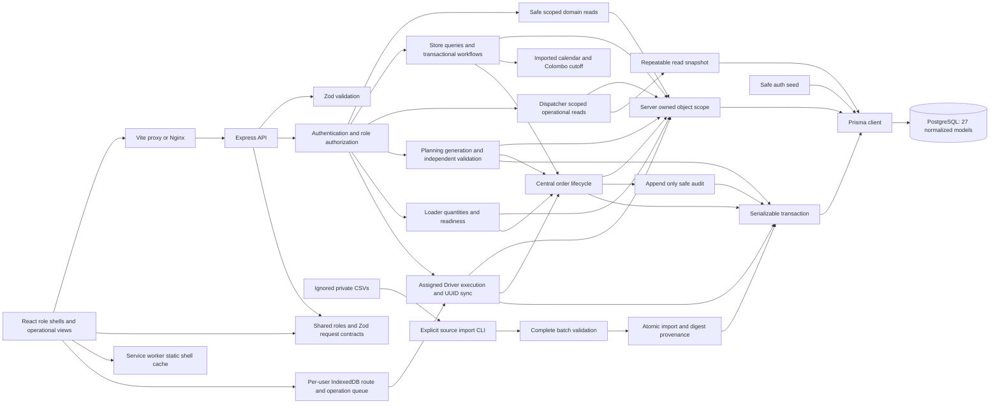

# Application architecture

Milestones 1–6 implement authentication, shared operational persistence, Store/Dispatcher workflows, deterministic planning/validation/release and Loader shortfall/review/readiness. Combined Milestones 7+8 passed local automated/browser acceptance for scoped Driver execution and durable offline recovery on those same generated records; [the Driver/offline report](milestone-7-8-driver-offline.md) records evidence and limits. ML and final packaging/deployment remain outside this work.

The server owns identity. Login compares a salted scrypt hash, creates a random session token, stores its HMAC digest and expiry, and issues an HTTP-only cookie. Authentication resolves the digest and checks expiry and current user active/role status on every protected request. Logout deletes the session. Online identity is restored through `/api/auth/me`. Driver alone has a sanitized IndexedDB identity fallback on network failure when its own route cache exists; HTTP 401 disables fallback. Passwords and session credentials are not cached. Driver logout requires connection and no unsynced operations before safe per-user cache removal.

All roles share authentication schemas/constants and shell components. Store, Dispatcher and Loader use TanStack Query against their scoped API data; Future Capacity has no predictions. Driver Today/Route/Proof/Sync use the separate offline hook, which exposes raw server data, cached route data and projected local operations distinctly. Driver content renders independently of the generic workspace request so network loss does not hide its cached route. Mutations invalidate affected Driver/Dispatcher/Store queries; cross-role reads use the same persisted quantities and records.

`apps/api/src/domain/` separates rules from Express transport. Its authenticated outlet/order/trip GET endpoints expose safe DTOs. All transport obtains actorUserId from the session; clients cannot choose identity or role. Domain `scope.ts` resolves the current active user again and defaults to denial without mappings: Store uses UserOutlet; Dispatcher/Loader use UserDepot; Driver needs its assigned released trip. Loader mutations also require a trip that has not departed. The authentication seed grants no automatic domain assignments.

`lifecycle.ts` owns order transitions, persisted prerequisites, role/scope checks, optimistic versions and audit insertion. Its transaction-taking variant lets Store, Planning, Loader and Driver services create related records and transition atomically. Early receipt tests retain explicitly prepared historical records; the current operational services generate and execute their own actual plan/trip/stop records.

## Store service boundary

`apps/api/src/store/` separates Store scope, cutoff rules, DTO queries and transactions from the Express router. Every Store endpoint requires the authenticated Store Manager role and exactly one UserOutlet assignment for the current active account. Missing or ambiguous assignments deny access. Order queries include both the requested order ID and the resolved outlet ID; foreign orders return the same 404 as unknown orders. POST schemas reject ownership, creator, brand, depot and role injection. Brand/depot derive through the trusted assigned Outlet relationship.

| Endpoint | Persisted behavior |
| --- | --- |
| `GET /api/store/context` | Assigned outlet, brand rules, server clock/cutoff and imported future operating dates |
| `GET /api/store/home` | Counts for upcoming, deferred, awaiting receipt, completed and attention; recent orders and actionable exceptions |
| `GET /api/store/orders?status=&date=` | Scoped status/requested-date filtering; newest 100 rows with total count |
| `GET /api/store/orders/:id` | Quantity facts, version, audit timeline, deferrals, trip/stop timing, receipt and relevant exceptions |
| `POST /api/store/orders` | Atomic DRAFT creation, ORDER_CREATED audit and centralized CONFIRMED transition |
| `POST /api/store/orders/:id/receipt` | Versioned receipt and issue transaction with centralized receipt transition |

Store query responses use `Cache-Control: no-store`. Reads use repeatable-read transactions so counts and related DTOs share a database snapshot. Home limits its recent list to 20 and attention list to 10; counts cover all matching records. Detail timeline events come from AuditEvent, ordered by timestamp and persisted version when transaction timestamps tie. Planned and actual arrival/departure/completion remain distinct nullable facts. An unplanned order has no invented vehicle or ETA. Deferral reasons/dates come from DeferralRecord. Proof responses expose persisted recipient metadata and presence flags, with `binaryAvailable: false`; they do not expose storage keys or fake image URLs.

The cutoff is evaluated on the server at **16:00 Asia/Colombo**, including exactly 16:00. Today/past dates, absent calendar rows and non-operating requested dates are rejected. Only a tomorrow request submitted at or after cutoff shifts eligibility to the first later imported operating date, strictly after tomorrow. The original requestedDeliveryDate and createdAt remain intact; eligibleDeliveryDate records the consequence and the DTO explains it. If no later operating date exists, creation fails. Fresh supports ambient/chilled/frozen with daily context; Style and Tech support ambient with weekly/as-needed context respectively. No product catalog or assumed weekday schedule is introduced.

Order creation uses a serializable transaction, generates `WP-YYYYMMDD-<32 hexadecimal UUID characters>` without counting existing orders, and confirms through the central lifecycle. A PostgreSQL serialization conflict may retry creation up to five times after the initial attempt, with bounded exponential backoff of 10/20/40/80/160 ms. Every attempt resolves current identity, assignment and calendar data again. Rolled-back attempts leave no order/audit records. Duplicate-key errors and receipt/version conflicts are not automatically retried.

Receipt creation requires a completed successful delivery, the expected current order version and no existing receipt. A delivered/partially delivered order can advance through centralized AWAITING_RECEIPT inside the same transaction before its receipt transition. Matching received/delivered quantities with no reported issue create CONFIRMED and RECEIPT_CONFIRMED. A mismatch automatically becomes QUANTITY_DISCREPANCY; explicit damaged goods or other receipt issues also create ISSUE_REPORTED, a linked open Exception and RECEIPT_ISSUE. Issues require a useful note. Clean receiving notes are retained too. Ordered, loaded, delivered and received facts stay separate, and no duplicate receipt audit is manually added. Any unresolved receipt-linked exception prevents clean lifecycle confirmation. Dispatcher Exception Centre reads these records; resolution remains later integration work because business resolution rules are not defined yet.

`npm run demo:assign-store` is an explicit local, non-production assignment command; replacing an existing assignment requires its `--replace` option. It writes UserOutlet rather than frontend identity. Official assignments remain private/local, and raw competition files remain inaccessible to the frontend. Publication-safe synthetic references and historical receipt scenarios require explicit judge setup. `STORE_ALLOW_SYNTHETIC` defaults to false; explicit development/test opt-in permits synthetic eligibility, and production configuration/services reject it. The normal auth seed stays reference- and assignment-free.

## Dispatcher service boundary

`apps/api/src/dispatcher/` separates depot scope, date/filter rules, DTO mapping and repeatable-read queries from Express transport. Shared Dispatcher Zod contracts reject invalid dates, filters and pagination. Every endpoint requires an active current Dispatcher account with one or more UserDepot mappings; no assignment means denial. A depot filter narrows authenticated scope and cannot grant ownership. Foreign depot filters return 403; direct foreign order/trip/exception IDs return the same 404 as unknown IDs. Related exception paths require all non-null order/trip/load/delivery/receipt links to remain in scope. Trip reads reject a trip containing any foreign-outlet stop, and order reads reject active assignments into a foreign/mixed-depot trip. These fail-closed reads supplement existing SQL depot/relationship guards.

| Endpoint | Read-only behavior |
| --- | --- |
| `GET /api/dispatcher/context?date=` | Selected date/source, imported calendar row or unknown, assigned depots and scoped date/district options |
| `GET /api/dispatcher/pulse?date=` | Scoped status counts, open attention, master fleet summary and bounded order/trip previews |
| `GET /api/dispatcher/orders` | Date-basis, status, brand, depot, district, temperature, deferral-history and reference-search filters; pagination |
| `GET /api/dispatcher/orders/:id` | Separate quantity/date facts, outlet constraints, assignment, actual audit timeline, deferrals and related issues |
| `GET /api/dispatcher/planning-context?date=` | Unassigned confirmed demand, separate deferred review context, master vehicles, existing trips and reference constraints |
| `GET /api/dispatcher/trips` | Selected service-date trips with depot/status/reference filters and pagination |
| `GET /api/dispatcher/trips/:id` | Persisted stop sequence, active/history flags, planned/actual times and ordered capacity totals |
| `GET /api/dispatcher/exceptions` | Selected operational-date issues with depot/status/type/search filters and pagination |
| `GET /api/dispatcher/exceptions/:id` | Exact persisted issue and related order/delivery/receipt facts, without evidence storage keys |

All responses are no-store. Orders/Trips/Exceptions default to page 1, limit 25, with a maximum limit of 100 and total count. Orders search matches order/outlet references. Orders support `dateBasis=OPERATIONAL` (default) or `REQUESTED`, `status`, `brand`, `depotId`, `district`, `temperatureRequirement`, `previouslyDeferred=true|false` and `search`. Pulse/Planning show all assigned depots; the list screens can narrow that scope. DTO queries use batched relation includes and aggregates rather than per-row queries.

Selected dates are real YYYY-MM-DD values, maintained in Dispatcher URL/query context. The server chooses an explicit request date first, then optional validated `DISPATCHER_DEMO_DATE`, then the earliest unassigned confirmed/closed order's eligible date (requested-date fallback), then the most recent scoped operational record date, and finally today's Asia/Colombo date. `dateSource` explains that choice. Scoped persisted date options are bounded; the selected date need not be one of those options. CalendarDay is reported exactly as persisted, with OFFICIAL/SYNTHETIC source; a missing row stays unknown. Viewing a date does not create an operating calendar day.

For operational filtering, an order's active Trip.serviceDate takes precedence; otherwise eligibleDeliveryDate falls back to requestedDeliveryDate. Requested-date filtering uses the original request instead. Exception dates use their explicitly linked trip/stop first; an order-only issue uses that order's operational date. Issue creation time remains a separate timestamp. The same persisted Store Order/Exception IDs therefore propagate to the Dispatcher without fixture copying or client-side duplication.

Pulse totals aggregate all scoped records for the selected operational date. Awaiting planning counts CONFIRMED/CLOSED_FOR_PLANNING; planned counts PLANNED; loading/ready counts RELEASED_TO_LOADING/LOADING/LOADING_EXCEPTION/READY_FOR_DISPATCH; in transit counts IN_TRANSIT/ARRIVED. Delivered counts DELIVERED/PARTIALLY_DELIVERED/AWAITING_RECEIPT/RECEIPT_CONFIRMED/RECEIPT_ISSUE; receipt issues are a subset of that delivered group. Deferred counts current DEFERRED orders. Open exceptions count OPEN and UNDER_REVIEW Exception records, which can exceed affected-order count. Active trips include PLANNED/RELEASED/LOADING/READY_FOR_DISPATCH/IN_TRANSIT. Previews are bounded to 12 orders, 8 trips and 10 attention exceptions; these previews do not limit metric counts.

Planning foundation includes unassigned CONFIRMED/CLOSED_FOR_PLANNING orders whose initial eligible/requested date is on or before the selected imported operating date. Unknown/non-operating selected calendars yield no established eligible demand and explicitly report UNKNOWN/NON_OPERATING. Unassigned DEFERRED backlog appears separately for review; it is not claimed eligible or automatically scheduled, and the latest recorded nextEligibleDate remains visible. Totals aggregate all matching confirmed demand, while previews are capped at 100 orders, 100 deferred orders, 200 vehicles and 50 existing trips with explicit limits. Master vehicle counts/capacities describe reference records, including their active flags; `operationalAvailability: UNKNOWN` prevents treating absence of trips as verified availability. Trips report ordered units/weight/volume, not unmeasured actual loaded weight/volume.

Deferral warnings use retained record count and latest persisted reason/time/date, without a fairness score or an unproven consecutive-deferral claim. Exception origin uses an audit actor-role snapshot when the creation transaction matches; otherwise it explicitly reports CURRENT_ACCOUNT or UNKNOWN rather than inventing historical identity. Proof display remains metadata only. Routes show lists and stored times, with no GPS simulation, invented coordinates or fake map tiles. Planning and loading-shortfall review mutations are described separately; general exception resolution remains deferred and Future Capacity has no predictions. None of these GET endpoints creates Allocation, Trip, state changes or operational audit events.

`npm run demo:assign-dispatcher` explicitly assigns one or more local development depots through UserDepot; changing existing scope requires `--replace`. The M4 judge scenario uses independently authored SYNTHETIC data and prepared historical trips. They remain explicitly distinct from generated trips through persisted planning provenance. Auth seeding still grants no assignments and imports no fixture data.

## Planning service boundary

`apps/api/src/planning/` separates persisted input gathering, reusable candidate constraints, deterministic selection, an independent complete-result validator and transactional services. Shared Zod schemas accept only selected service date/depot and expected run identifiers/versions. Active Dispatcher/UserDepot scope is resolved for every operation. Each run belongs to one explicitly selected assigned depot; foreign run IDs are not found.

Bulk reads gather eligible orders, explicit VehicleAvailability, vehicle masters, weekly opening/usage/reservations, existing trip timing, CalendarDay, depot/district travel and brand/dock service allowances. Unknown fuel or availability does not become zero usage/readiness. All eligible demand is considered or generation rejects an explicit server bound. The allocator never reads precomputed allocation CSVs or calls an AI/ML service.

Generation creates an inspectable DRAFT run, DRAFT trips/active stops, ASSIGNED/DEFERRED allocations, fuel reservations, central CLOSED_FOR_PLANNING/DEFERRED transitions and audit events. Candidate evidence is not final validation. The validator independently sums capacities/fuel, checks coverage/identity/versions/sequence and recomputes stored timing against the declared reference model; it does not invoke the allocator/candidate evaluator. Validating a valid run sets VALIDATED, PLANNED trips/orders, and updated expected versions. Release rechecks current facts and independent validity inside a serializable transaction, then sets RELEASED and centrally transitions served orders to RELEASED_TO_LOADING. An audit/action failure rolls back the whole operation. Generated unreleased previews are unavailable to Loader/Driver domain reads; Loader’s operational UI consumes the released records.

Source snapshots/digests and expected order/run versions protect changes in demand, master capacities, availability, travel/service, calendar, fuel and other trip facts. Regeneration supersedes only the current expected unreleased generated run, cancels its trips/deactivates stops, voids only its reservations and retains previous allocation/deferral/audit history. Released history cannot be destructively regenerated. Safe structured operation logs include run identifiers/counts and omit credentials, tokens and raw datasets. See [Milestone 5](milestone-5-allocation.md) for exact policies and verification status.

Committed SQL constraints enforce quantities, trip limits, relationship consistency and immutable history. An order status update requires the lifecycle transaction flag to prevent accidental direct ORM writes. A privileged database operator can set that flag; authorization remains the server service boundary. Audit events are append-only and deferral facts cannot be deleted/replaced. Use `prisma migrate deploy`; `db push` cannot reproduce these SQL checks/triggers.

The private CLI requires all five CSVs, validates before writing, and imports in one serializable transaction. ReferenceImport stores source, file/content digests and counts. Identical content is a no-op; conflicting changed content fails atomically and requires explicit later reconciliation. Auth seeding never imports reference data. Private sources are excluded from Git/Docker and never served by the frontend. Official data was imported into the local development database only.

Local development uses the Vite same-origin proxy and a loopback API; Docker uses Nginx and an internal API/database network. Container startup applies migrations and seeds missing auth accounts before API health becomes ready. Production mode requires HTTPS origin and Secure session cookies. Local testing uses an isolated PostgreSQL process with real migrations and Prisma, independent of Docker availability.

Tests migrate isolated databases and preserve earlier authentication/order/date fixtures alongside separate Store, Dispatcher, Planning, Loader and Driver scenarios. The ninth additive migration supplies Driver versions/timestamps and OfflineOperation; prior migration files are retained. Combined required checks and actual browser offline/reload/reconnect/conflict acceptance passed; final counts and evidence are in [the combined report](milestone-7-8-driver-offline.md). The pre-Driver eight-migration Docker baseline passed at source `05e8eb1`; current Driver/offline images and deployment have not been verified by that run.

Reference: [Prisma Docker deployment documentation](https://docs.prisma.io/docs/guides/deployment/docker).

## Loader service boundary

`apps/api/src/loader/` provides list/detail/load/readiness services; Dispatcher Exception Centre adds minimal loading revision review. Current active role/UserDepot is resolved inside each transaction. Trips require released generated provenance, matching run/vehicle/stop/outlet/allocation depot relationships and no departure. Reads use RepeatableRead; mutations use Serializable and optimistic trip/order/stop/load tokens. Client actor/depot fields are rejected.

Normal loading completes LoadRecord separately from immutable ordered units. A shortfall creates LOADING_SHORTFALL with pending review and central LOADING_EXCEPTION. Dispatcher approval completes the load and resolves that same exception; rejection retains history and permits a versioned Loader correction. Audit snapshots preserve prior quantities/reasons after correction. Ready checks all stop loads and unresolved linked loading exceptions, transitions orders centrally and persists Trip READY_FOR_DISPATCH with audit. Loader does not depart the trip; Driver owns Start Trip. Audit failures roll back loading, review and readiness. TanStack mutations invalidate Loader/Dispatcher/Store queries; ten-second Loader polling and refetch/re-login expose approval. See [M6 evidence](milestone-6-loader.md).

## Driver execution boundary

`apps/api/src/driver/` separates scoped DTOs, source/assignment guards and transactional actions from transport. A Driver sees only its own ready/in-transit/completed generated trips with released run provenance, valid stop/allocation relationships and satisfactory approved loads. Dispatcher assigns an active Driver through the scoped/versioned Routes action before departure; neither seed nor React hardcodes a trip. Missing/foreign/unready sources fail closed.

Start stores actualDeparture, centrally advances orders to IN_TRANSIT and audits the trip. Current-stop arrival requires expected trip/stop/order versions, records actualArrival and advances ARRIVED. Completion requires arrival, correct current sequence and a loaded-consistent outcome: full equals loaded, partial is lower and positive, failed is zero. Partial/failed require controlled reasons; selected reasons require a useful note. Successful/partial proof requires recipient name and role. DeliveryRecord, metadata DeliveryProof, stop status/version, central order lifecycle and audit commit atomically. Full delivery advances to AWAITING_RECEIPT; partial/failed retain their outcome and an operational Exception. Ordered/loaded facts are never overwritten and no receipt is created.

Finish requires terminal outcomes for all active stops, records Trip.completedAt and COMPLETED, and leaves actualReturn null. Completion means all delivery stops finished, not verified depot arrival. Proof contains recipient metadata, quantity/outcome/note/time only; photo/signature storage is unavailable and no illustration is used as evidence. Existing Store/Dispatcher queries expose the same delivery quantities, proof and progress.

## Driver offline and synchronization boundary

`apps/web/src/offline/` owns per-user IndexedDB route/identity/queue storage, pure local projections and ordered synchronization. `useDriverWorkspace` exposes server routes, cached routes, cache timestamp, operations, connection/sync status and projected trips separately. Mutations save a UUID operation first, then synchronize when connected. The UI labels cached/local events and pending proof until acknowledgement. ARRIVAL precedes COMPLETE_DELIVERY by trip/version/action order. Queue statuses include PENDING/SYNCING/SYNCED/FAILED/CONFLICT; failures/conflicts remain visible and local evidence is retained rather than silently replaced. A base snapshot preserves pending work when newer server reads diverge.

The production Vite build emits a versioned service worker that precaches index, manifest, logo and generated JS/CSS. The build wrapper sets Vite NODE_ENV=production independently of local development `.env`, and the Web Dockerfile includes that wrapper. Navigation has an offline shell fallback; `/api/` and cross-origin requests are excluded. Operational routes live in IndexedDB rather than authenticated API response caches. Only the active Driver's assigned route and required proof/operations are saved; no password, token or raw dataset is cached. HTTP 401 hides the active Driver fallback. Logout refuses unsynced work, preventing silent destruction. Session-generation checks reject late auth/route results and cache writes after login/logout or identity changes, preventing cleared cache from being recreated. The localStorage fence is a non-secret generation marker shared by tabs, never a server credential; blocked shared storage disables offline fallback. Device/browser storage loss remains a limitation.

`POST /api/driver/sync` accepts at most 20 UUID operations and processes them sequentially. OfflineOperation stores authenticated user, immutable action/payload hash, versions, client/creation/received timestamps and result. Same UUID/account/payload returns its saved success or conflict; differing identity/payload conflicts. Expected trip/stop/order versions protect against stale writes. Operation commit includes lifecycle/delivery/audit and idempotency result in one transaction. FAILED operations may retry unchanged; SYNCED/CONFLICT identity and results are SQL-immutable. Later actions stop after an earlier non-success. Idempotent replay adds no delivery or audit.

Fresh connected queued operations use server event time; offline or delayed operations retain clientEventAt, with raw client/creation timestamps persisted separately. The server rejects implausible future/old/device-clock timestamps and event ordering before departure/arrival. Reconnect and a 30-second retry interval attempt sync; manual Sync now is available. Driver online route reads poll every 15 seconds. Vite development mode does not register the service worker; offline reload acceptance uses the built judge preview.

