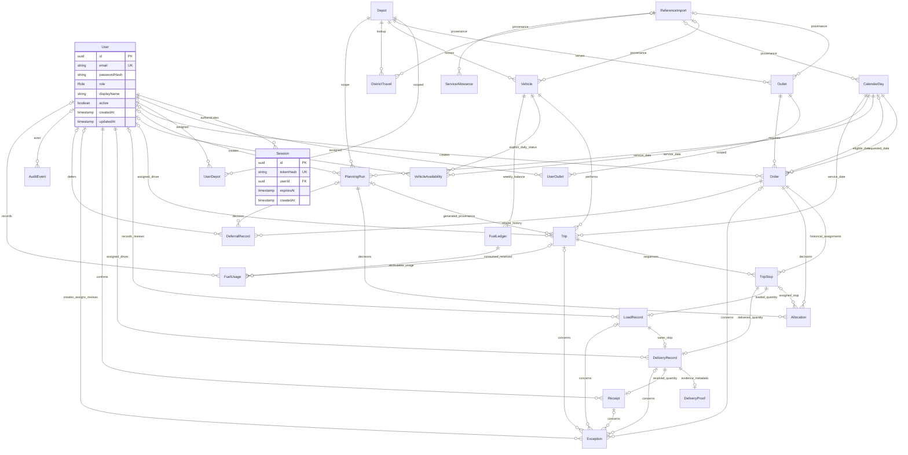

# Operational data model

Milestone 2 introduced 25 models: the original User/Session plus 23 domain/support models. Milestones 3 and 4 retain them and add Store fields and Dispatcher indexes. Milestone 5 adds VehicleAvailability and planning provenance/version/snapshot/timing fields, bringing the schema to 26 models. `prisma/schema.prisma` and the eight saved migrations define the authoritative schema. Milestone 6 reuses all 26 models; local M6 acceptance passed.

The Role enum supports DISPATCHER, LOADER, DRIVER, STORE_MANAGER. Shared TypeScript definitions drive request types, role homes and UI labels; the Prisma enum constrains persisted values.

Normalized lowercase email is unique. Password hashes include scrypt parameters and random per-user salt. Session token digests are unique; indexes cover user role, session user and expiry. Deleting a user cascades to sessions. UUIDs are generated by the Prisma client; operational models can later relate to User without altering the authentication boundary.

The seed creates only four demo identities and preserves existing accounts. It imports no prototype, reference or allocation records and creates no scope assignments. Controlled local development/judge commands assign the Store Manager through UserOutlet and Dispatcher through one or more UserDepot rows. Explicit synthetic judge setup remains separate from installation seeding. Outlet/depot ownership is never hardcoded in frontend code.

## Reference data and dates

Outlet retains unique reference, brand, district, depot, dock, NORMAL/VAN_ONLY/MALL_DOCK access and delivery/mall windows. Windows are increasing local minute-of-day pairs. No addresses or GPS coordinates are fabricated. Vehicle retains TRUCK/VAN and AMBIENT/REEFER enums, positive decimal capacities/efficiency/quota, fuel, depot and active state. Order requirements separately distinguish AMBIENT/CHILLED/FROZEN for later compatibility checks.

CalendarDay preserves source operating/payday/festival/fractional festival-ramp/holiday/monsoon/weekend fields and validated weekday/ISO context. The official source uses a Sunday-only weekend flag; it is preserved rather than inventing a Saturday flag. DistrictTravel is keyed by BOTH depot and district; ServiceAllowance by brand and dock type. Official rows require import provenance; synthetic records cannot establish official eligibility by default.

Business dates use PostgreSQL DATE with strict YYYY-MM-DD values encoded at UTC midnight for Prisma. This encoding represents a date, not an operational instant. Operational instants use timestamptz(3); instant-to-business-date conversion uses Asia/Colombo. Fuel weeks run Monday 00:00 Asia/Colombo through the next Monday. Authentication timestamp types remain unchanged.

Milestone 3 orders retain requestedDeliveryDate and separately record eligibleDeliveryDate, both referencing CalendarDay. The new nullable eligibility field supports older/domain fixture records with requested-date fallback. The migration backfills existing rows from their requested date. New Store orders always set eligibility. At or after 16:00 Asia/Colombo, a tomorrow request moves eligibility to the first imported operating date strictly after tomorrow, leaving the original request and creation instant unchanged. Missing, past/today or non-operating requested dates are rejected; an unavailable next operating date also rejects creation. A database check prevents eligibility before the original request, and stop guards prevent an assignment before eligibility. Calendar source flags govern eligibility, including any operating Sunday or closed weekday; no weekday assumptions replace them.

Dispatcher operational-date reads prefer the active Trip.serviceDate when an assignment exists; unassigned orders use eligibleDeliveryDate with requested-date fallback. An explicit REQUESTED date basis instead filters the original request. Exceptions use the date of their linked trip/load/delivery/receipt stop, or their order's operational date when order-only. Created timestamps remain separate. The selected viewing date is validated and may come from the URL, configured deterministic demo date, scoped persisted demand/trips or the current Asia/Colombo date. A missing CalendarDay is exposed as unknown, never created by a read request.

## Operational integrity

Order retains original ordered units/weight/volume, outlet, requested/eligible dates, temperature, creator, confirmation, status and version. Confirmed requests, including their eligibility date, cannot be silently rewritten. Store references use `WP-YYYYMMDD-<32 hexadecimal UUID characters>`; competition order references and array/count-based numbering are not reused. Outlet, creator, brand and depot come from authenticated server relationships. Fresh supports AMBIENT/CHILLED/FROZEN; Style and Tech accept AMBIENT. LOADED, DELIVERED and RECEIVED quantities live in separate records. Expected snapshots must match upstream quantities. Loading cannot change after delivery exists; delivered facts cannot change after receipt exists.

Receipt remains unique per DeliveryRecord. Its nullable issueType enum adds QUANTITY_DISCREPANCY, DAMAGED_GOODS and OTHER without rewriting legacy issue records. New Store receipt requests use the order's expectedVersion. Receipt, linked Exception, lifecycle update and audit commit atomically. Matching quantities with no issue produce CONFIRMED; mismatched quantities or an explicit damage/other issue produce ISSUE_REPORTED and leave the Order in RECEIPT_ISSUE. A mismatch defaults to QUANTITY_DISCREPANCY even if the request initially chose no issue. Damaged goods use a DAMAGED_GOODS Exception; quantity/other receipt issues use RECEIPT_DISCREPANCY with the exact issueType retained on Receipt. Issue notes require at least five trimmed characters. Optional clean receiving notes are retained in issueNote too. Existing receipt duplicates and stale versions are conflicts. Issue correction/resolution is not exposed as a Store mutation in this milestone.

Trip belongs to one vehicle/date with tripNumber 1 or 2, driver, timing, distance and version. A partial unique vehicle/date/number index for non-CANCELLED trips plus the retained range check prevents a third active trip while permitting historical cancelled draft slots to be reused. TripStop has unique trip/sequence and one active assignment per order across trips; historical inactive assignments remain. Allocation points to a stop for ASSIGNED, has no stop for DEFERRED, and derives trip/vehicle through the stop. Compound keys/triggers enforce matching order, date and depot. Dispatcher reads keep planned/actual times separate. M5 adds nullable generated PlanningRun provenance and estimatedFuelLitres to Trip, plus service start/completion and explicit waiting to TripStop; old prepared trips remain valid. Their current capacity totals sum original quantities on active stops, not unmeasured loaded weight/volume.

PlanningRun retains DRAFT/VALIDATED/RELEASED and adds SUPERSEDED for retained old previews. Generated runs record strategyVersion, revision, generated/updated/superseded instants, version, safe summary, source snapshot/hash, expected order versions and independent validation/hash. Legacy prepared runs keep these optional fields null and are never described as generated. Generated per-depot/date revisions and the current unreleased-run uniqueness guard prevent competing active drafts. Release requires the validated current version and rechecks fresh facts.

VehicleAvailability is an explicit unique vehicle/service-date record with AVAILABLE/UNAVAILABLE, reference source, recorder/note and optional local-minute availability bounds. AVAILABLE requires explicit increasing start/end bounds within the day; absence means UNKNOWN. Master active/type/capacity does not establish readiness. Synthetic records are fixture evidence requiring explicit non-production planning opt-in.

LoadRecord preserves expected/actual units, reason, recorder, revision and review. Dispatch transitions require completed loading, approved revisions and resolved loading exceptions. DeliveryRecord preserves loaded snapshot, delivered/partial/failed outcome, quantity, notes, instants and assigned driver. DeliveryProof stores recipient metadata and durable storage keys; browser blob/data URLs are rejected. Store and Dispatcher responses display persisted metadata/presence flags only, omit storage keys and explicitly mark binary content unavailable. Binary upload/access/retention remain later work.

Exception has structured category/scope/review columns with category-appropriate, consistent relationships. Store issue details and attention queries include relevant order/load/delivery/receipt relationships, including records without a direct orderId. Shared trip-wide records are not exposed through that order detail. DeferralRecord appends each decision/reason/date; repeated DEFERRED transitions increment version and retain new history. Resolution can be recorded once without deleting earlier facts. AuditEvent has nullable system actor, server role, typed event/entity, timestamp and allowlisted state/version/reason/source/count/quantity metadata. Recipient details, credentials and tokens are excluded by the audit service. Its typed entity reference is not a polymorphic foreign key. Store creation writes ORDER_CREATED once and the centralized confirmation writes ORDER_CONFIRMED. Receipt transitions supply their own audit events. When PostgreSQL transaction timestamps tie, Store timelines use persisted versions to retain creation/transition order.

Dispatcher Exception Centre reads the same Receipt-linked Exception IDs produced by Store services. Scope covers every non-null relationship path, including load/delivery/receipt-only exceptions without orderId. Origin role comes from a matching creation-transaction AuditEvent snapshot when available; CURRENT_ACCOUNT/UNKNOWN is explicit otherwise. Read-only status/type/date/depot/search filters do not resolve or delete records. Dispatcher order details report total deferral record count plus latest reason/time/date and retained history; no fairness or consecutive-deferral score is inferred. Their timelines use persisted audit timestamps and versions just as Store tracking does.

FuelLedger is unique per vehicle/Monday date. Nullable openingConsumedLitres means unknown history, not zero. FuelUsage records CONSUMED/RESERVED litres independently of quota with source, trip and ACTIVE/VOIDED status. Established balances and history are retained. Availability returns known=false and remainingLitres=null without an opening balance; synthetic balances are never authoritative. No historical opening balance was supplied/imported.

## Central order lifecycle

`ORDER_TRANSITIONS` in `apps/api/src/domain/lifecycle.ts` includes all 17 statuses. The main path is:

`DRAFT → CONFIRMED → CLOSED_FOR_PLANNING → PLANNED → RELEASED_TO_LOADING → LOADING → READY_FOR_DISPATCH → IN_TRANSIT → ARRIVED → DELIVERED/PARTIALLY_DELIVERED → AWAITING_RECEIPT → RECEIPT_CONFIRMED/RECEIPT_ISSUE`.

Branches cover DEFERRED/replanning, LOADING_EXCEPTION/review, DELIVERY_FAILED/retry and reviewed receipt issues. Each transition checks role, current scope, expected version and persisted prerequisites. State/history/audit commit or roll back together. M5 generation closes served demand for planning while creating DRAFT previews; independent successful validation enables PLANNED; release enables RELEASED_TO_LOADING. A controlled Dispatcher-only PLANNED→CLOSED_FOR_PLANNING transition is allowed only when superseding its own generated unreleased run, with cancelled/inactive old assignments. Released/prepared history cannot use this reversal. Superseded draft deferrals retain immutable history/counts but do not themselves delay reconsideration of that same draft demand; other effective deferral dates still apply. Confirmation checks requested/eligible calendars. Store receipt safeguards and separate quantities remain unchanged. M6 Loader transitions to LOADING/LOADING_EXCEPTION and, after satisfactory reviewed loads, READY_FOR_DISPATCH. The scoped Loader may now use LOADING_EXCEPTION→READY_FOR_DISPATCH while retaining central prerequisites. Driver execution remains later work.

Store creation uses serializable transactions with at most six attempts for PostgreSQL serialization conflicts: the initial attempt and five retries with 10/20/40/80/160 ms backoff. Every retry rechecks active identity, assignment and imported eligibility; rolled-back attempts leave no data. Duplicate-key and receipt/version conflicts are returned for review without automatic retries.

## Migration and object scope

The original authentication migration and two additive Milestone 2 domain migrations create tables/enums/keys and SQL checks/history triggers. The fourth migration, `20261003000300_store`, adds nullable eligibleDeliveryDate with backfill/calendar FK/date check, adds ReceiptIssueType/Receipt.issueType, and replaces the order/stop guards to preserve eligibility and enforce its scheduling floor. Existing migrations remain intact. User/Session scalar data is preserved. Actual PostgreSQL tests cover fresh installation, repeated deploy/seed and explicit Milestone 1 upgrades with complete fingerprints. The existing development database also upgraded in Milestone 2 with exact authentication-data preservation. Apply committed migrations; schema push alone omits SQL guards.

The fifth migration, `20261003000400_dispatcher_indexes`, adds Order(eligibleDeliveryDate, status) for the dated eligible-demand queue and Exception(createdAt, id) for deterministic paged issue ordering. It changes no operational rows or lifecycle rules. Existing requested-date/status, outlet/status, depot/district, service-date/status, exception status/type and deferral order/time indexes remain. No speculative additional relationship indexes were added without query-plan evidence.

The sixth migration, `20261003000500_allocation`, adds planning/availability/timing fields and guards without rewriting the prior migration history or authentication/order facts. It replaces only trip-slot uniqueness as described above and adds safe run audit entity/event types. Fuel reservations retain their immutable amount/history with ACTIVE/VOIDED status. A reservation's occurredAt belongs to the planned service week; createdAt/generatedAt record when planning actually happened. Own reservations are excluded from remaining-input fuel only while their exact active matching persistence is independently verified.

The seventh additive migration, `20261004000600_allocation_history`, protects released generated run facts, allocation decisions and planned trip/stop identity/timing from updates/deletion. Prepared legacy fixtures retain their prior behavior. Trip/stop operational status, assigned driver and actual quantities/timestamps remain available to future scoped Loader/Driver workflows. Release writes final order versions in its single run update inside the transaction before lifecycle transitions; any later failure rolls everything back.

Store uses UserOutlet; its implemented services require exactly one assignment for the active Store Manager. The relation supports multiple mappings structurally, but missing or ambiguous mappings deny Store workflow access rather than choosing an arbitrary outlet. Scoped order queries combine order ID and resolved outlet ID, returning 404 for foreign orders. Dispatcher/Loader use UserDepot; Driver uses assigned released trips. Loader mutation scope additionally requires no departure. Imported reference rows do not grant assignments. Scope guards protect direct reads and centralized transitions as well as UI callers. Synthetic eligibility is disabled by default, requires explicit non-production `STORE_ALLOW_SYNTHETIC`/test options and is forbidden in production.

Dispatcher supports multiple assigned depots with default denial when none exist. Its optional depot query narrows those mappings; it cannot grant new scope. Foreign filtered depots are forbidden, while foreign direct IDs are not found. Dispatcher reads additionally fail closed on malformed mixed-depot relationships: a trip containing a foreign-outlet stop is excluded, an own order actively assigned to a foreign/mixed trip is excluded, and linked exception paths require both order and trip scope. Existing database guards already reject normal mixed-depot writes; these read checks protect the DTO boundary independently.

Dispatcher queries are repeatable-read snapshots and produce no operational writes. Paginated Orders/Trips/Exceptions default to 25 rows and cap at 100 with total counts. Pulse metrics aggregate all matches independently of previews. Planning totals likewise aggregate all matching unassigned CONFIRMED/CLOSED_FOR_PLANNING demand whose eligible/requested date is on or before a selected imported operating day. Unknown/non-operating calendars establish no eligible demand. Unassigned DEFERRED backlog is separate review context with its actual nextEligibleDate, not an automatic assignment. Preview limits are explicit: 100 demand orders, 100 deferred orders, 200 master vehicles and 50 existing trips. GET requests create no Allocation, Trip, state changes or operational audit events; prepared judge trips remain independently authored fixture records.

The eighth additive migration, `20261004000700_loader`, adds only LOAD_RECORDED, MANIFEST_REVISION_APPROVED and MANIFEST_REVISION_REJECTED audit enum values. No model or quantity columns are added. Existing LoadRecord.revision and TripStop.updatedAt supply optimistic tokens. LoadRecord.reason stores the selected reason plus optional note; review actor/time/status remain explicit. LOAD_RECORDED/review snapshots preserve original and revised quantities, reasons and exception identity. Rejection/correction retains prior Exception messages and rejected audit history. All eight migrations passed fresh/repeat and earlier upgrade preservation tests.

