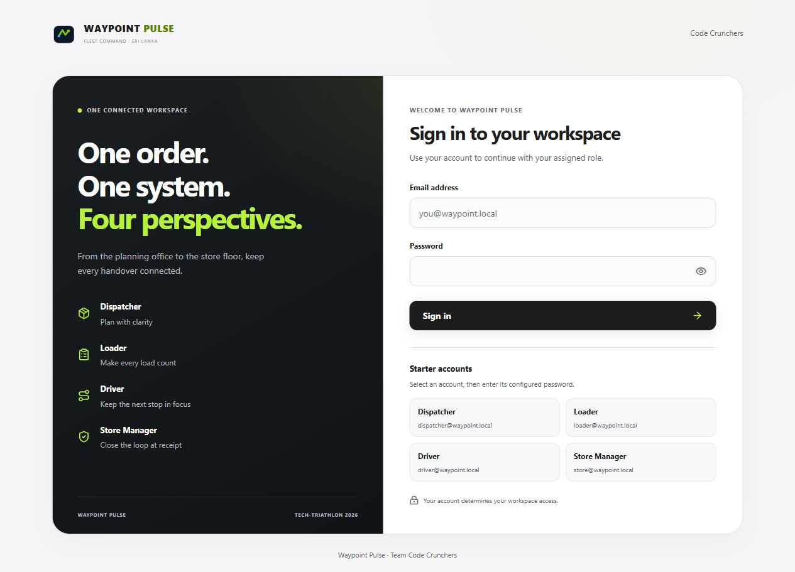

# Screenshot evidence

Use the six `production-starter-*` images below for the current starter setup. The other 96 images record earlier development and acceptance scenarios. They contain synthetic test orders, fixed scenario dates, released plans and completed deliveries that were removed from the public application when it was reset for normal use.

Screenshots are dated observations. Users can create orders and progress the workflow after capture; a screenshot does not promise that the shared database stays empty. See [production starter readiness](../production-starter-readiness.md) for the reset, deployment and verification evidence, and [the root README](../../README.md) for installation and operation.

## Current starter views

The five workspace files were captured from the deployed application on **2026-10-05**, after clearing operational test history. They are **921 × 641 pixels** and show the visible browser viewport; content below the fold is omitted. They use the normal Sri Lanka operational date and publication-safe reference records, without a Competition Demo guide or preloaded workflow. The separate full-page sign-in capture was taken on **2026-10-06**, with empty credential fields and all four Starter accounts visible; it creates no session or business record.

| Image | Visible evidence |
| --- | --- |
| [Sign in and Starter accounts](production-starter-login.jpg) | Complete sign-in form and four pre-created role account selectors; a selector fills an email and still requires its configured password |
| [Store home](production-starter-store.jpg) | Assigned synthetic outlet, zero upcoming/deferred orders and the Place New Order entry point |
| [Place order](production-starter-place-order.jpg) | Upper part of the new delivery request form, assigned outlet and normal next-day cutoff guidance; no order was submitted |
| [Dispatcher planning](production-starter-planning.jpg) | October 5, 2026, no generated run and planning actions disabled while eligible demand is absent |
| [Loader workspace](production-starter-loader.jpg) | October 5, 2026, with released loads, expected units, awaiting approval and ready-for-dispatch counts all zero |
| [Driver workspace](production-starter-driver.jpg) | Connected server data, October 5, 2026, and no ready routes assigned |

The October 7 request date visible in the order-form capture reflects the cutoff at capture time. Available dates are evaluated from the actual clock and operating calendar; it is not a fixed startup date.

## Historical evidence groups

These groups preserve the original synthetic acceptance captures. Read their associated report for the source revision, scenario, scope and limitations. Statements in an earlier screenshot such as “photo and signature capture are unavailable” describe that milestone; the later media feature is documented separately.

| Filename prefix | Images | Purpose and report |
| --- | ---: | --- |
| `foundation-*` | 3 | Initial sign-in branding and role shells: [Milestone 1](../milestone-1-foundation.md) |
| `store-*` | 11 | Order creation, tracking, receipt issues and foreign-order denial: [Milestone 3](../milestone-3-store.md) |
| `dispatcher-*` | 16 | Persisted order/route/exception reads, planning context and responsive checks: [Milestone 4](../milestone-4-dispatcher.md) |
| `allocation-*` | 13 | Generated decisions, rejection reasons, validation/release and responsive layouts: [Milestone 5](../milestone-5-allocation.md) |
| `loader-*` | 11 | Loading, shortfall review, readiness and cross-role propagation: [Milestone 6](../milestone-6-loader.md) |
| `driver-*` | 14 | Delivery outcomes, real browser offline reload/sync and retained conflicts: [Milestones 7 + 8](../milestone-7-8-driver-offline.md) |
| `final-production-*` | 9 | Earlier deployed four-role and offline workflow with synthetic demand: [Final integration verification](../final-hackathon-verification.md) |
| `media-*` | 11 | Synthetic photo/signature galleries, offline previews and a route map: [Media and maps verification](../media-maps-verification.md) |
| `competition-review-*` | 8 | The previous prepared review guide and execution/completed examples, now historical: [Previous review preparation](../competition-review-readiness.md) |

The five JSON files in this folder are historical synthetic benchmark, persisted-result and responsive-measurement evidence. They are not startup data or current production database snapshots.

## Capture quality and interpretation

All **101 original PNG/JPEG-named files** decoded successfully during the initial screenshot audit, and the additional October 6 sign-in capture was separately inspected. Their image metadata contains no EXIF records. Several historical `.png` filenames contain JPEG captures; original bytes and filenames are retained to preserve evidence links. The visible records use synthetic identities/reference labels and authored test proof images; no confidential competition source records, service credentials or reported real Driver GPS positions were observed in the visual review. The map fixture's recorded coordinates are explicitly synthetic in its report.

Open an image at its original size to read small desktop text or long mobile captures. Numeric filename suffixes are historical capture labels, not guarantees of raster dimensions; browser scrollbars and cropping can change the saved width. Some captures intentionally show validation errors, access denial, retained conflicts or pending local work.

The following original files need narrower captions because their names alone can mislead:

| Original file | What it actually shows |
| --- | --- |
| [foundation-login-1440.jpg](foundation-login-1440.jpg) | A 462 × 1000 promotional-column crop, with clipped heading text and no sign-in form; use only as early branding evidence |
| [dispatcher-planning-1280.png](dispatcher-planning-1280.png) | Future Capacity, rather than Planning Studio |
| [dispatcher-pulse-1440.png](dispatcher-pulse-1440.png) | The Orders screen, rather than Today's Delivery Pulse |
| [driver-dispatcher-exceptions.jpg](driver-dispatcher-exceptions.jpg) | The exception list while the selected detail pane is still loading; it does not establish loaded detail acceptance |
| [driver-synced-390.jpg](driver-synced-390.jpg) | Synced operations and zero pending work, with a retained sign-out warning; it does not establish a clean sign-out |
| [media-offline-signature.png](media-offline-signature.png) | An earlier local pending-signature preview; the later accepted centered preview is [media-production-signature-preview.png](media-production-signature-preview.png) |

Original screenshot bytes are preserved. Current setup documentation uses the starter images, while historical reports retain their original evidence and record these caption limits. Screenshots complement the recorded database/browser/CI checks; they do not establish physical phone camera, touch signature, GPS or keyboard acceptance.
